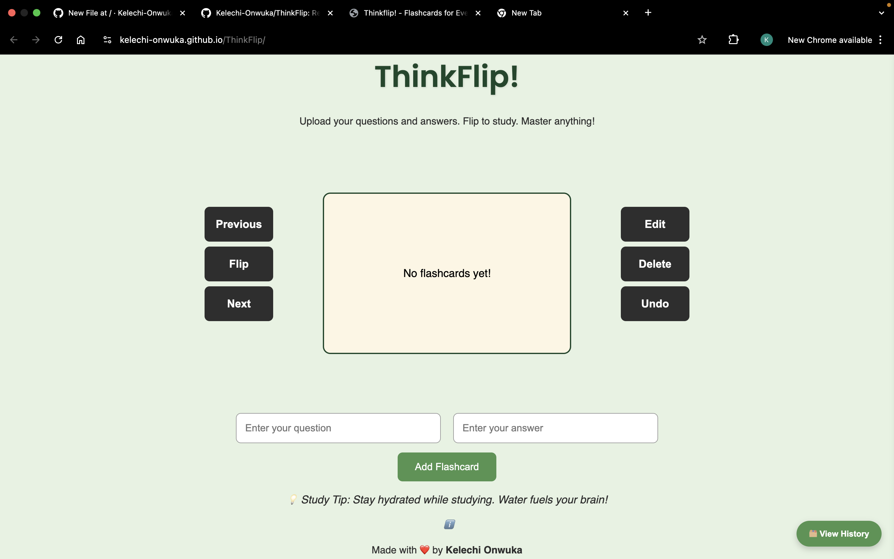

# ThinkFlip

A responsive flashcard web app built with HTML, CSS, and JavaScript. Users can create, flip, and manage flashcards to study more effectively.

Originally built for friends preparing for exams, ThinkFlip is designed for anyone looking for a quick, no-signup study tool. Now includes persistent flashcard saving using local storage.

## Features

- Add custom questions and answers
- Flip cards to test memory
- Edit or delete flashcards
- Undo recent deletions
- View flashcard history
- Study tips that rotate automatically
- **Flashcards are saved automatically (via browser local storage)**
- **"Welcome Back" message for returning users**
- Mobile-friendly layout

## Mobile Usage
*Mobile-friendly, but best used on a laptop or desktop.*

## How to Use

1. Open the `index.html` file in a web browser
2. Enter a question and answer
3. Click "Add Flashcard"
4. Use **Flip**, **Next**, and **Previous** to navigate

> A live version is also available here:  
> **[https://kelechi-onwuka.github.io/ThinkFlip](https://kelechi-onwuka.github.io/ThinkFlip)**

## Tech Stack

- HTML
- CSS (Responsive design with Flexbox & Grid)
- JavaScript (DOM manipulation + localStorage)

## Planned Features

- User authentication (sign up / login)
- Flashcard syncing across devices using a database

---

### Contact

Made with ❤️ by **Kelechi Onwuka**

---

## License

MIT License
